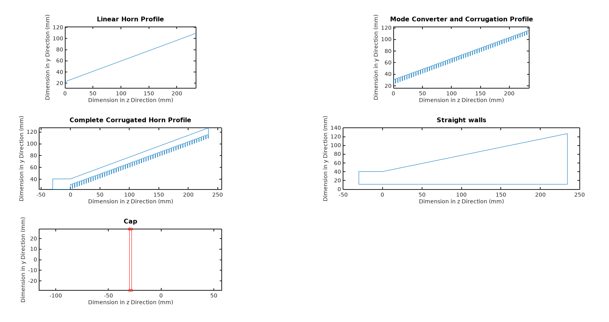
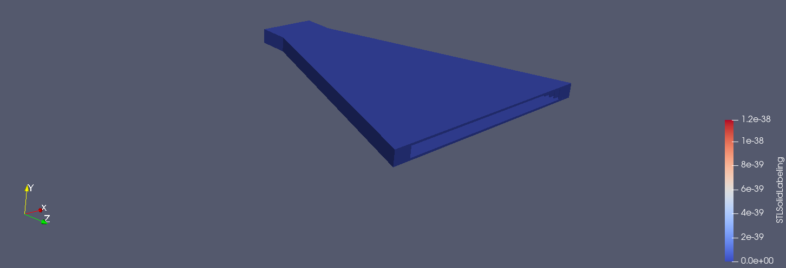
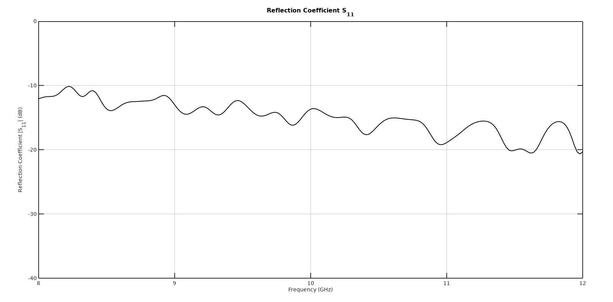
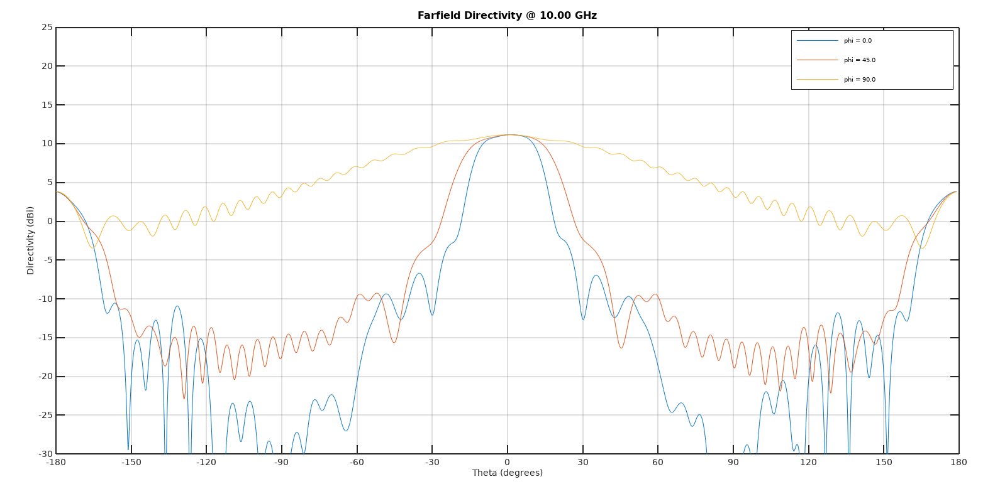
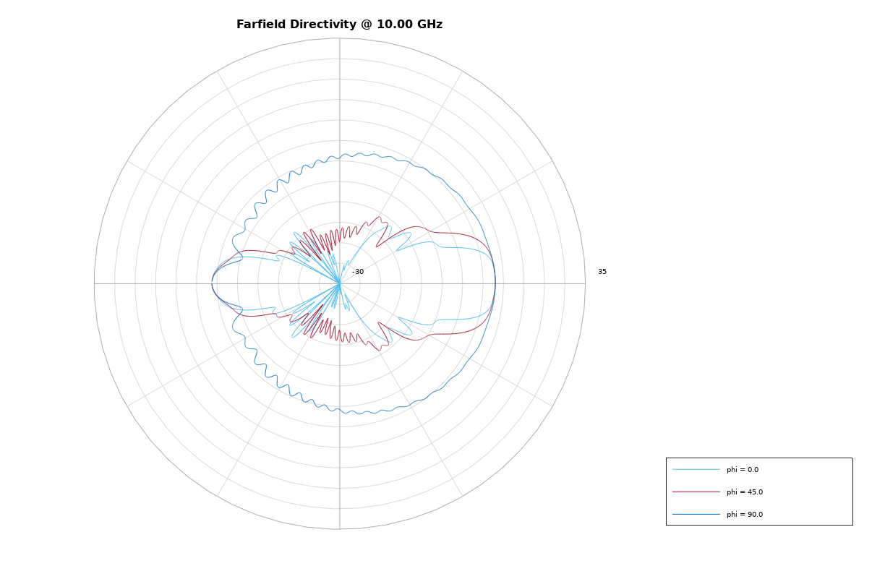
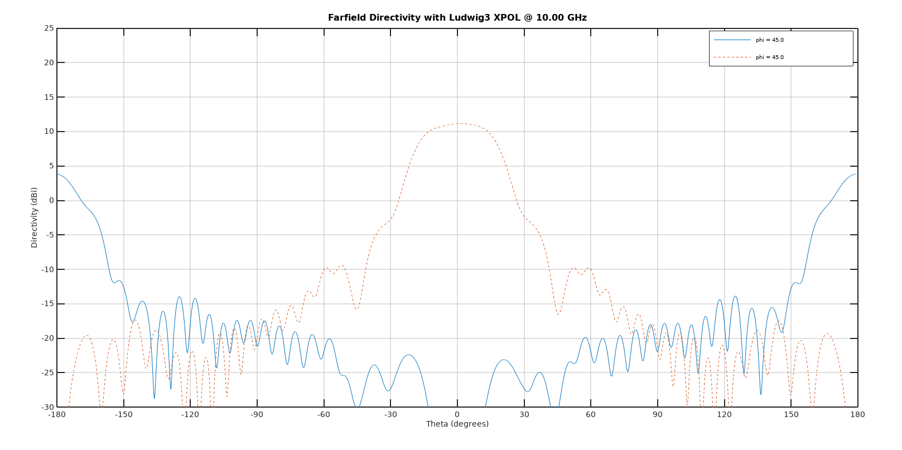
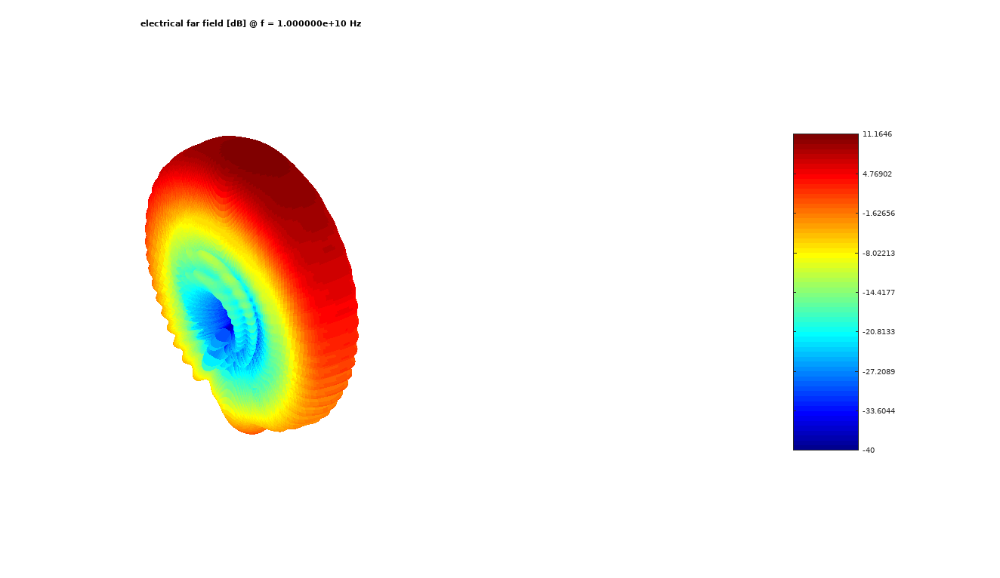
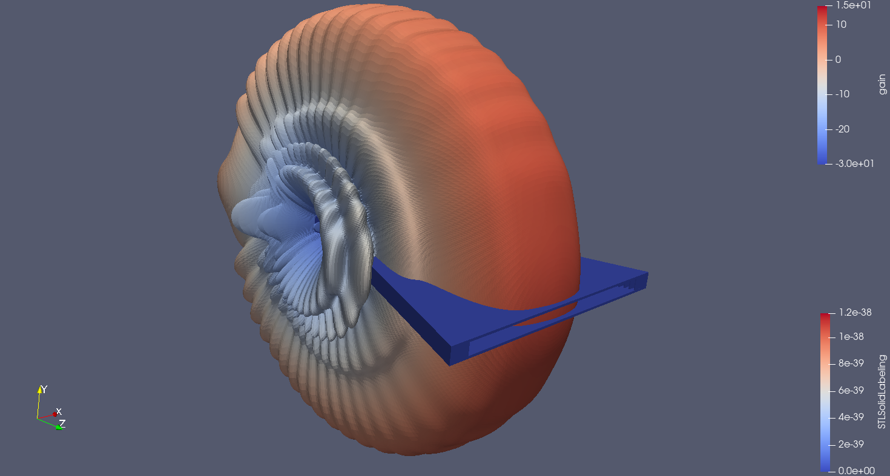

# Testing structures

## [Structure_test](https://github.com/monteiroman/medidas2_magicScript/tree/main/Tests/Structure_test)

### test.m
Simple extruded horn face. It was a test in how to make a straight horn wall from the calculated corrugated profile.

### test_walls.m
Semi-corrugated horn inside a mesh.

## [Simulation_test](https://github.com/monteiroman/medidas2_magicScript/tree/main/Tests/Simulation_test)

### test_first.m
Test first piramidal corrugated horn.

### test_second.m
Test with piramidal semi corrugated horn. At the moment we are facing some memory problems with this script but some results can be seen below.

**2D Structure parts obtained from openEMS** 

**3D Structure in paraView** 

**Reflection coeficient** 

**Farfield Directivity** 

**Farfield Directivity polar coordinates** 

**Farfield Directivity Ludwig3 coordinates** 

**Farfield Directivity Ludwig3 coordinates** 

**3D Structure in paraView** 
