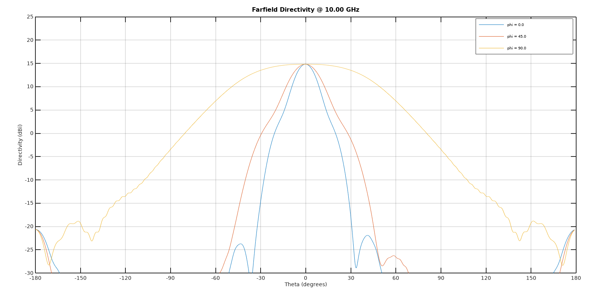
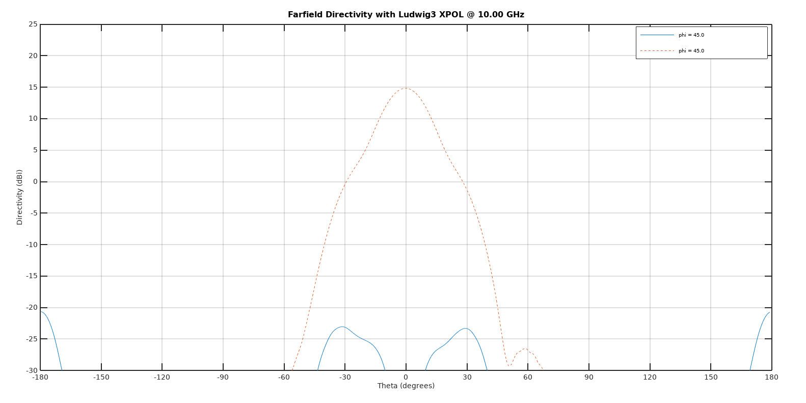

# Testing structures
***
## [Structure_test](https://github.com/monteiroman/medidas2_magicScript/tree/main/Tests/Structure_test)

### 1) test.m
Simple extruded horn face. It was a test in how to make a straight horn wall from the calculated corrugated profile.

### 2) test_walls.m
Semi-corrugated horn inside a mesh.

### 3) test_horn_with_chokes.m
Simulation of horn designed on [1] (see references in this [readme](/README.md)).

***
## [Simulation_test](https://github.com/monteiroman/medidas2_magicScript/tree/main/Tests/Simulation_test)

### 1) test_first.m
First test of a piramidal corrugated horn.

### 2) test_second.m
Test with piramidal semi-corrugated horn. At the moment we are facing some memory problems with this script but some results can be seen below.

|2D Structure parts obtained from Octave|3D Structure in paraView|
|:---:|:---:|
|||

|Reflection coeficient|Farfield Directivity|
|:---:|:---:|
|||

|Farfield Directivity polar coordinates|Farfield Directivity Ludwig3 coordinates|
|:---:|:---:|
|||

|Radiation Patern OpenEMS|Radiation Patern and 3D structure in Paraview|
|:---:|:---:|
|||

### 3) test_horn_with_chokes_simulation.m

Test with corrugated horn designed at [1](see references [here](/README.md)). At the moment we are facing some memory problems with this script but some results can be seen below.

|2D Structure parts obtained from Octave|3D Structure in paraView|
|:---:|:---:|
|||

|Reflection coeficient|Farfield Directivity|
|:---:|:---:|
|||

|Farfield Directivity polar coordinates|Farfield Directivity Ludwig3 coordinates|
|:---:|:---:|
|||

|Radiation Patern OpenEMS|Radiation Patern and 3D structure in Paraview|
|:---:|:---:|
|||

### 4) test_corrugated_horn.m

Tangential profile Corrugated Horn

|2D Structure parts obtained from Octave|3D Structure in paraView|
|:---:|:---:|
|||

|Reflection coeficient|Farfield Directivity|
|:---:|:---:|
|||

|Farfield Directivity polar coordinates|Farfield Directivity Ludwig3 coordinates|
|:---:|:---:|
|||

|Radiation Patern OpenEMS|Radiation Patern and 3D structure in Paraview|
|:---:|:---:|
|||